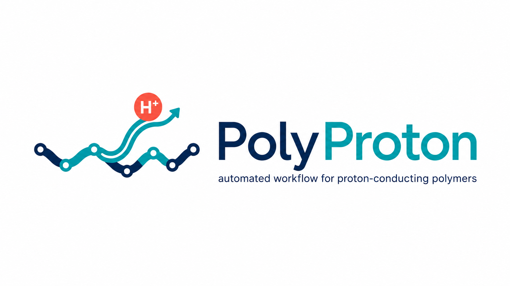

<p align="center">
  
</p>

# PolyProton
This repository contains as automated workflow for constructing, equlibrating, and analyzing
sulfonated polyimide (SPI) electrolyte systems for proton conductivity studies. The workflow
is designed around Amber molecular dynamics simulations and post processing of dry, hydrated
and hydronium containing conductivity systems. The workflows is currently tailored to sulfonated
polyimide, but the code structure can be adapted to related polymer electrolyte systems by 
chaning the monomer SMILES definitions, residue templates, input files, and analysis settings.

## Workflow overview
The complete workflow has two main codes:
"PolyProton_simulation.py"
"PolyProton_analysis.py"

The simulation workflow is organized into four stages:

1. Parameterization / structure generation
	- Builds the SPI monomer from backbone and sulfonated side-chain SMILES
	- Generates conformers using RDKit
	- Optimizes and ranks conformers based on energy using MACE (mace-off)
	- Selects either the lowest or a higher energy conformer
	- Calculate RESP charges of selected conformer using ORCA (wb97x-d4/def2-svp)
	- Builds polymer chains with fixed or mixed chain lengths
	- Creates Amber residue templates and force field files

2. Dry polymer equilibration
	- Packs the polymer chains into a periodic dry bulk cell using Packmol
	- Create Amber topology and coordinate files using LeAP
	- Runs either a 6-step or 12-step dry equilibration protocal
	- Produces the dry equilibrated structure and trajectory

3. Hydrated polymer equilibration
	- Adds water molecules at selected hydration levels (lambda values)
	- Runs hydration equilibration protocal
	- Produces hydrated structures and trajectories for each lambda value

4. Conductivity simulation
	- Creates hydronium-water systems for selected hydration levels
	- Runs conductivity production simulation (100 ns)
	- Produces trajectories

## Requirements
The simulation workflow requires the following
1. Programs:
- Amber / AmberTools >= 24
- ORCA >= 5.0.3
- Multiwfn >= 3.8
- OpenBabel = 3.0.0!
- Packmol >= 20.15.1
2. Python packages (python >= 3.8)
- ase
- rdkit
- mace 
- numpy
- pandas
- scipy
- biopython

The analysis workflow requires the following
1. Python packages (python >= 3.8)
- numpy
- pandas
- scipy
- matplotlib
- ovito

## Main simulation settings
Most user controlled simulation settings are defined near the top of "PolyProton_simulation.py". 
The simulation workflow is intended to be run from the project root directory.
Simulation files are written under the `simulation/` folder, while analysis results are written
separately under the `analysis/` folder.

Example:
```
polymer = "a1"

backbone_smiles = "C1=CC2=C3C(=CC=C4C3=C1C(=O)OC4=O)C(=O)OC2=O"
sidechain_smiles = "OCCCS(O)(=O)=O"
benzene_smiles = "C1=CC=CC=C1"

conf_num = 50
conf_selection = "best"
temperature = 300
conf_far_fraction = 0.5
conf_prune_rms_thresh = 0.02

chain_length = 15
num_chains = 30
mix_chains = True
mix_seed = 42
aligned = True

lam_list = [2, 4, 6, 8, 10, 12]
cond_lam_list = [12]

dry_eq_prot = "6-step"

run_param = True
run_dry = True
run_hyd = True
run_cond = True

use_gpu = True

```

Important options:
| Setting | Meaning |
|---|---|
| `polymer` | Polymer label, such as `a1`, `a6`, or `a8`. This label is used in generated file names. |
| `backbone_smiles` | SMILES string of the dianhydride-backbone unit. |
| `sidechain_smiles` | SMILES string of the sulfonated side chain. |
| `benzene_smiles` | SMILES string of the benzene-backbone unit. |
| `conf_num` | Target number of conformers to generate. The actual number may be lower after RDKit pruning. |
| `conf_selection` | Selects the conformer used for parameterization. Use `"best"` for the lowest-energy conformer or `"random"` for a randomly selected higher-energy/diverse conformer.|
| `temperature` | Temperature used for Boltzmann weighting of conformers. |
| `conf_far_fraction` | Fraction of high-energy/diverse conformers used as the random selection pool when `conf_selection = "random"`. |
| `conf_prune_rms_thresh` | RDKit conformer pruning threshold. Smaller values retain more similar conformers; `-1.0` disables pruning. |
| `chain_length` | Number of repeat units in the base polymer chain. This value is also used in generated file names. |
| `num_chains` | Number of chains packed into the bulk simulation cell. This value is also used in generated file names. |
| `mix_chains` | If `True`, generates a distribution of chain lengths around chain_length. If `False`, all chains use exactly `chain_length`. This value also affects generated file names. |
| `mix_seed` | Random seed used to generate mixed chain lengths when `mix_chains = True`. |
| `aligned` | If `True`, uses aligned/compact initial packing. If `False`, uses less-aligned initial orientations. |
| `lam_list` | Hydration levels prepared and equilibrated during the hydration workflow. Hydration level defined by λ, thus the number of water molecules equivalent to sulfonic acid group.  |
| `cond_lam_list` | Hydration levels selected for conductivity simulations. These must be included in `lam_list`. |
| `dry_eq_prot` | Selects the 6-step or 12-step dry equilibration protocol. |
| `run_param` | Enables or disables monomer parameterization and polymer-chain generation. |
| `run_dry` | Enables or disables dry polymer packing and dry equilibration. |
| `run_hyd` | Enables or disables hydrated polymer equilibration. |
| `run_cond`  | Enables or disables hydronium-containing conductivity simulations. |
| `use_gpu` | Controls Amber MD execution mode. If `True`, supported MD steps use `pmemd.cuda`. If `False`, all Amber MD steps use `pmemd.MPI`. |

GPU/CPU exacution
```
use_gpu = True
```
With this setting, supported Amber MD steps are run with `pmemd.cuda`. Some steps, such as MIN and NPT, may still be run with `pmemd.MPI`.
```
use_gpu = False
```
To run the workflow only in CPU/MPI mode with `pmemd.MPI`.

## Main analysis settings
The analysis workflow is controlled near the top of "PolyProton_analysis.py".
The following settings must match the simulation settings because they are used to reconstruct 
the expected system names and locate the correct simulation files:

```
polymer = "a1"

chain_length = 15
num_chains = 30
mix_chains = True
```

Therefore, when analyzing a simulation, make sure that `polymer`, `chain_length`, `num_chains`, and `mix_chains` in `PolyProton_analysis.py`
are the same as those used in `PolyProton_simulation.py`.

Important options:
| Setting | Meaning |
|---|---|
| `polymer` | Polymer label used to identify the system. Must match the simulation workflow. |
| `chain_length` | Base polymer chain length used in the simulation. Must match the simulation workflow. |
| `num_chains` | Number of polymer chains used in the simulation. Must match the simulation workflow. |
| `mix_chains` | Whether mixed chain lengths were used. Must match the simulation workflow because it changes the system name. |
| `run_dry_analysis` | Enables or disables analysis of the dry polymer system. |
| `run_hyd_analysis` | Enables or disables analysis of hydrated systems. |
| `run_cond_analysis` | Enables or disables analysis of hydronium-containing conductivity systems. |
| `dry_eq_prot` | Must match the dry equilibration protocol used in the simulation. It determines which dry production trajectory is analyzed. |
| `hyd_analysis_lam_list` | Hydration levels selected for hydrated-system analysis. |
| `cond_analysis_lam_list` | Hydration levels selected for conductivity analysis. |

## Notes and limitations

- The workflow assumes that required input templates, water/hydronium PDB files, Amber input files, and force-field files are present in `input_files/`.
- The current conductivity calculation is based on hydronium vehicle diffusion and Nernst-Einstein conductivity.
- The conductivity simulation is set to 100 ns, which cannot be changed right now. 
- Fitting window for MSD is set to 10-100 ns by default. This should be checked for each system to ensure that the selected time range is approximately linear.
- The water-cluster analysis uses an O-O cutoff of 3.5 Angstrom. This cutoff should be kept consistent when comparing systems.
- The hydronium-sulfonate residence analysis uses a 4.0 Angstrom cutoff. This cutoff is a structural definition of bound/contacting hydronium and may need sensitivity testing.
- If `mix_chains = True`, the reported system name keeps the base chain length but the actual chain-length distribution is written to the workflow log.
- The actual number of generated conformers may be smaller than `conf_num` because of conformer embedding or pruning.

## License

PolyProton is distributed under the BSD 3-Clause License.
This license applies only to the PolyProton source code and documentation in this repository.
External software packages used by the workflow, including Amber/AmberTools, ORCA, Multiwfn, OpenBabel, Packmol, OVITO, MACE, RDKit, ASE, and other dependencies,
are distributed under their own licenses. Users are responsible for obtaining and using these third-party programs according to their respective license terms.

## Citation

If you use PolyProton in academic work, please cite the associated publication.
Citation information will be added after publication.
